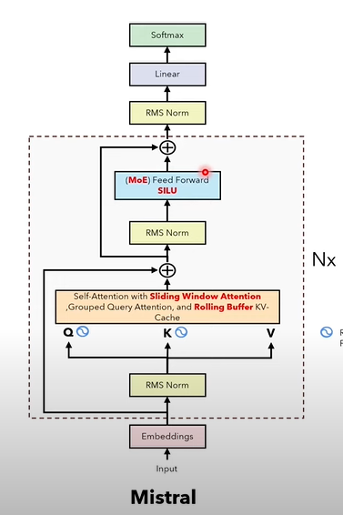
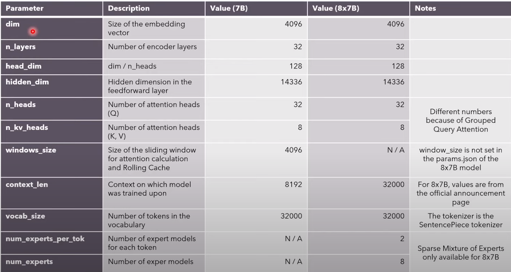

# Mistral-7b-PyTorch
- Implementation of Mistral 7b using PyTorch

- Look at the model params

Sliding window attention  - Rolling buffer cache  - Prefill and chunking - FF - MoE - ResidualBlock
  
